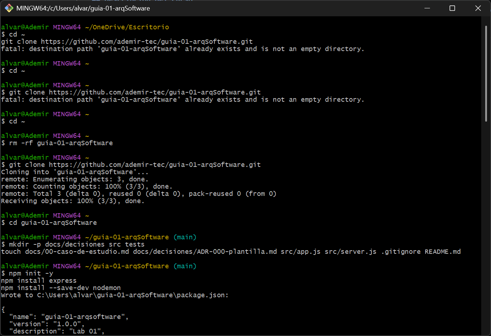
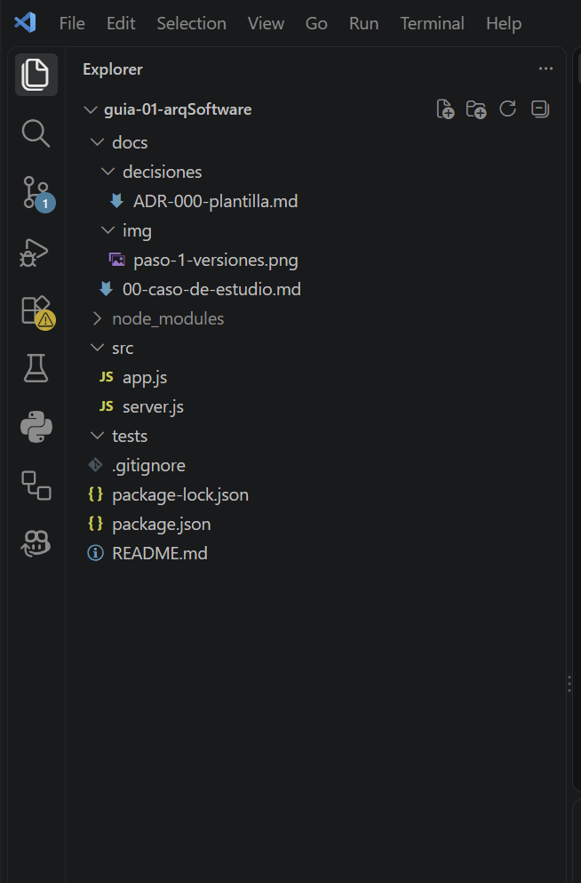

# Guía 01: Configuración del entorno y repositorio

**Nombre completo del estudiante:** Alvaro Ademir Ayala Arango
**Código:** 27210401
**Curso:** IS-488 Arquitectura de Software
**Docente:** Ing. Lizbeth Jaico Quispe
**Semestre:** 2026-II

## Descripción del curso
El curso de Arquitectura de Software enseña a diseñar y estructurar sistemas de software, tomando decisiones clave sobre componentes, capas, patrones y tecnologías para construir aplicaciones escalables, mantenibles y de calidad.

## Expectativas del estudiante
Espero aprender a diseñar arquitecturas sólidas, comprender los patrones de diseño y ser capaz de justificar técnicamente las decisiones arquitectónicas en proyectos reales.

## Evidencias

### Paso 1: Verificación de versiones

### Paso 2: Estructura del proyecto
